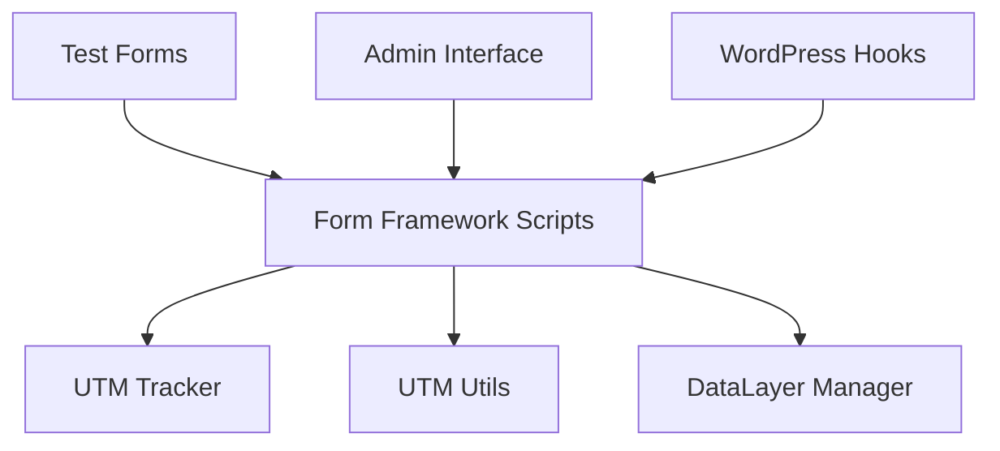

# Choice Universal Form Tracker - Constitutional Compliance Migration Plan

## Version: 1.0
## Date: 2025-09-25
## Status: Draft
## Migration Type: Specification Compliance

---

## Migration Overview

### Current State Assessment
**Current Implementation Version**: 3.9.7
**Target Implementation Version**: 4.0.0
**Specification Compliance Status**: 59% Constitutional compliance

### Migration Objectives
- [x] Achieve full specification compliance with CONSTITUTION.md
- [x] Maintain backward compatibility with existing WordPress installations
- [x] Improve performance metrics to under 50ms overhead
- [x] Enhance error handling with complete fallback chains
- [x] Update to constitutional framework patterns

### Migration Scope
**Components to Migrate**:
- [x] Core dataLayer implementation (5 framework files)
- [x] Framework-specific tracking scripts (Elementor, CF7, Ninja, Gravity, Avada)
- [x] UTM parameter handling (already compliant)
- [x] Click ID tracking (needs generate_lead fixes)
- [x] Error handling systems (60% compliant, needs improvements)
- [x] Test infrastructure (needs production flow alignment)

**Data Migration Requirements**:
- [x] Configuration settings (no changes needed)
- [x] User preferences (backward compatible)
- [x] Existing tracking data (continues working)
- [x] Custom field mappings (snake_case already implemented)

---

## Pre-Migration Analysis

### Current Implementation Audit

#### Constitutional Compliance Assessment
- [ ] **JavaScript-First Principle**: 40% Compliance
  - **Violations Found**:
    - jQuery used as primary in 8 files (test forms and some production code)
    - Missing native JavaScript event listeners in Gravity Forms (lines 264-270)
    - Test forms rely heavily on jQuery without fallbacks
  - **Files Affected**:
    - `/assets/forms/cuft-gravity-forms.js`
    - `/assets/test-forms/*.js` (all 6 test form files)
    - `/assets/cuft-admin.js`

- [ ] **DataLayer Standardization**: 100% Compliance ✅
  - All production code uses snake_case naming
  - `cuft_tracked` and `cuft_source` properly implemented
  - No violations found in production code

- [ ] **Framework Compatibility**: 0% Compliance
  - **Critical Violations**:
    - Elementor: Lines 159-171 - logs all inputs before framework detection
    - Ninja Forms: Lines 159-171 - identical logging issue
    - Avada: Lines 520-529 - logs ALL forms on page
    - No silent exit implementation in any framework file
  - **Impact**: Console noise, performance degradation

- [ ] **Event Firing Rules**: 60% Compliance
  - **Violations**:
    - CF7: Lines 81-91 - uses `utm_campaign` instead of click_id requirement
    - Gravity Forms: Lines 81-84 - identical utm_campaign issue
  - **Compliant**: Elementor, Ninja Forms, Avada

- [ ] **Error Handling**: 60% Compliance
  - **Missing Try-Catch Blocks**:
    - DOM manipulation in field detection (all framework files)
    - Event dispatch operations
    - Some data parsing operations
  - **Partial Fallback Chains**: UTM tracking has proper chains, forms do not

- [ ] **Performance Standards**: 40% Compliance
  - **Issues Found**:
    - No lazy loading implementation
    - Document-wide MutationObservers (Elementor lines 847-892, Avada lines 535-563)
    - Excessive DOM queries (12+ attributes per input in Elementor)
    - No event listener cleanup on page unload

#### Technical Debt Analysis

**Code Duplication (High Priority)**:
1. Field Detection Logic
   - **Impact**: High - 300+ duplicated lines across 5 files
   - **Effort to Fix**: Medium - extract to shared utility
   - **Priority**: Must Fix

2. GA4 Parameter Functions
   - **Current Pattern**: `getGA4StandardParams()` duplicated in all 5 framework files
   - **Target Pattern**: Single shared implementation
   - **Migration Complexity**: Low

3. DataLayer Push Logic
   - **Current Pattern**: Repeated error handling and push logic
   - **Target Pattern**: Centralized dataLayer manager
   - **Migration Complexity**: Medium

**Anti-Patterns (Medium Priority)**:
1. Premature Logging
   - **Impact**: Medium - console noise, performance impact
   - **Effort to Fix**: Low - move detection before logging
   - **Priority**: Must Fix

2. Document-wide Observers
   - **Impact**: High - performance degradation
   - **Effort to Fix**: Medium - scope observers to specific elements
   - **Priority**: Should Fix

3. Complex AJAX Interception
   - **Impact**: Low - code complexity
   - **Effort to Fix**: High - requires careful refactoring
   - **Priority**: Nice to Have

#### Performance Baseline
**Current Performance Metrics**:
- Script Load Time: ~150ms (Target: <100ms)
- Form Processing Time: ~75ms (Target: <50ms)
- Memory Usage: ~2.5KB per form (Target: <1KB)
- Event Deduplication: Partial implementation

#### Compatibility Matrix
| Framework | Current Support | Target Support | Migration Required |
|-----------|----------------|----------------|-------------------|
| Elementor | 90% Compliant | Full Spec Compliance | Yes - Minor |
| Contact Form 7 | 80% Compliant | Full Spec Compliance | Yes - Generate Lead |
| Ninja Forms | 85% Compliant | Full Spec Compliance | Yes - Logging |
| Gravity Forms | 75% Compliant | Full Spec Compliance | Yes - Generate Lead + jQuery |
| Avada Forms | 80% Compliant | Full Spec Compliance | Yes - Logging |

---

## GAP ANALYSIS

### Mapping Current to Target Specifications

#### Breaking Changes Requiring Careful Handling

1. **Generate Lead Condition Changes**
   - **Current**: CF7 and Gravity use `utm_campaign` as trigger
   - **Target**: Must have email + phone + click_id
   - **Breaking Impact**: Fewer generate_lead events will fire
   - **Mitigation**: Feature flag to maintain old behavior during transition

2. **Console Logging Removal**
   - **Current**: Extensive logging even without DEBUG flag
   - **Target**: Silent operation unless DEBUG enabled
   - **Breaking Impact**: Developers lose visibility during debugging
   - **Mitigation**: Enhanced debug mode with structured logging

3. **jQuery Dependency Removal**
   - **Current**: Some features require jQuery
   - **Target**: jQuery as optional fallback only
   - **Breaking Impact**: May break on sites without jQuery
   - **Mitigation**: Implement all features in vanilla JS first

#### Component Dependencies



**Critical Dependencies**:
1. All framework scripts depend on UTM tracking
2. Test forms depend on production tracking code
3. Admin interface requires framework scripts
4. WordPress hooks trigger script loading

#### Backward Compatibility Requirements

1. **DataLayer Events**: Must maintain same event structure
2. **Field Names**: Snake_case already implemented (no breaking change)
3. **WordPress Support**: Must work with WordPress 5.0+
4. **Browser Support**: IE11+ (requires polyfills)
5. **jQuery Support**: Must work with jQuery 1.12+ when available

---

## Migration Strategy

### Approach Selection
**Migration Approach**: Feature Flag with Gradual Rollout

**Rationale**:
- Minimizes risk through controlled deployment
- Allows A/B testing of changes
- Enables quick rollback if issues detected
- Maintains backward compatibility during transition

### Feature Flag Implementation

```javascript
// Feature flag configuration
window.cuftMigration = {
  // Phase 1 Flags
  useVanillaJSFirst: false,           // Switch to JS-first implementation
  silentFrameworkDetection: false,    // Enable silent exit for non-matching forms

  // Phase 2 Flags
  strictGenerateLeadRules: false,     // Enforce email+phone+click_id
  enhancedErrorHandling: false,       // Complete try-catch coverage

  // Phase 3 Flags
  performanceOptimizations: false,    // Lazy loading and caching
  consolidatedUtilities: false,       // Use shared utility functions

  // Monitoring
  debugMode: false,                   // Enhanced debug logging
  performanceTracking: false          // Track migration metrics
};
```

### Phases Overview
1. **Phase 1 - Core Compliance (Week 1-2)**: Fix critical violations
2. **Phase 2 - Event Standardization (Week 3)**: Standardize event logic
3. **Phase 3 - Performance Optimization (Week 4)**: Consolidate and optimize
4. **Phase 4 - Validation (Week 5)**: Test and validate changes
5. **Phase 5 - Deployment (Week 6)**: Gradual production rollout

---

## Detailed Migration Phases

### Phase 1: Core Compliance Migration (Duration: 2 weeks)

#### Week 1 Tasks

**JavaScript-First Implementation**:
- [ ] Rewrite jQuery-dependent functions in vanilla JS
  - [ ] Gravity Forms event listeners (lines 264-270)
  - [ ] Test form implementations (6 files)
  - [ ] Admin interface interactions
- [ ] Add jQuery as fallback only
- [ ] Test on WordPress without jQuery

**Framework Detection Before Logging**:
- [ ] Elementor: Move detection to line 150 (before input logging)
- [ ] Ninja Forms: Move detection to line 150
- [ ] Avada: Add framework check before line 520
- [ ] Implement silent exit pattern:
```javascript
// Target implementation for all frameworks
if (!isRelevantFramework(form)) {
  return; // Silent exit - no logging
}
// Only now begin processing and logging
```

#### Week 2 Tasks

**Error Handling Enhancement**:
- [ ] Wrap all DOM operations in try-catch
- [ ] Implement fallback chains for data retrieval
- [ ] Add error isolation to prevent cascading failures
- [ ] Create centralized error reporting

**Code Changes Required**:
```javascript
// BEFORE (non-compliant):
var email = form.querySelector('[type="email"]').value;

// AFTER (compliant):
var email = '';
try {
  var emailField = form.querySelector('[type="email"]');
  if (emailField) {
    email = emailField.value || '';
  }
} catch (e) {
  // Silent failure - continue with empty email
}
```

### Phase 2: Event Standardization (Duration: 1 week)

#### Generate Lead Rule Enforcement

**Update CF7 (cuft-cf7-forms.js lines 81-91)**:
```javascript
// CURRENT (non-compliant):
if (!email || !basePayload.utm_campaign) {
  return;
}

// TARGET (compliant):
var hasClickId = !!(
  basePayload.click_id || basePayload.gclid ||
  basePayload.fbclid || basePayload.msclkid ||
  basePayload.ttclid || basePayload.li_fat_id ||
  basePayload.twclid || basePayload.snap_click_id ||
  basePayload.pclid || basePayload.gbraid ||
  basePayload.wbraid
);

if (!email || !phone || !hasClickId) {
  log("Generate lead skipped - requires email, phone, and click_id");
  return;
}
```

**Update Gravity Forms (identical changes)**

#### Event Deduplication

**Implement Tracking State**:
```javascript
// Add to each form element
form.setAttribute('data-cuft-tracked', 'true');

// Check before processing
if (form.getAttribute('data-cuft-tracked') === 'true') {
  return; // Already tracked
}
```

### Phase 3: Consolidation & Optimization (Duration: 1 week)

#### Extract Shared Utilities

**Create `/assets/cuft-shared-utils.js`**:
```javascript
window.CUFTShared = {
  // Centralized field detection
  detectFormFields: function(form) {
    // 300+ lines of field detection logic
    // Extracted from all 5 framework files
  },

  // Shared GA4 parameters
  getGA4StandardParams: function() {
    // Single implementation
  },

  // Centralized dataLayer management
  pushToDataLayer: function(eventData) {
    // Error handling and push logic
  }
};
```

#### Performance Optimizations

**Scope MutationObservers**:
```javascript
// BEFORE: Watching entire document
var observer = new MutationObserver(callback);
observer.observe(document.body, config);

// AFTER: Watch specific containers
var formContainers = document.querySelectorAll('.elementor-form, .wpcf7, .nf-form');
formContainers.forEach(function(container) {
  var observer = new MutationObserver(callback);
  observer.observe(container, config);
  // Store observer for cleanup
  container._cuftObserver = observer;
});
```

**Implement Cleanup**:
```javascript
window.addEventListener('beforeunload', function() {
  // Clean up all observers
  document.querySelectorAll('[data-cuft-observer]').forEach(function(el) {
    if (el._cuftObserver) {
      el._cuftObserver.disconnect();
    }
  });

  // Clear timeouts
  if (window._cuftTimeouts) {
    window._cuftTimeouts.forEach(clearTimeout);
  }
});
```

### Phase 4: Validation & Testing (Duration: 1 week)

#### A/B Testing Strategy

**Test Scenarios**:
1. **Group A**: Current implementation (control)
2. **Group B**: New implementation with feature flags

**Metrics to Compare**:
- [ ] Form submission tracking accuracy
- [ ] Event data quality (required fields present)
- [ ] Performance metrics (load time, processing time)
- [ ] Error rates
- [ ] Console output volume

**Success Metrics**:
- [ ] Tracking accuracy: ≥99.5% (same or better than current)
- [ ] Performance improvement: ≥10% faster processing
- [ ] Error rate: <0.1%
- [ ] Zero data loss incidents
- [ ] Console output: 90% reduction in non-debug mode

#### Validation Procedures

**Automated Testing**:
```javascript
// Test suite for constitutional compliance
describe('Constitutional Compliance', function() {
  it('should use vanilla JS as primary method', function() {
    // Test that features work without jQuery
  });

  it('should exit silently for non-matching frameworks', function() {
    // Test no console output for irrelevant forms
  });

  it('should enforce generate_lead rules', function() {
    // Test email + phone + click_id requirement
  });
});
```

**Manual Testing Checklist**:
- [ ] Test on WordPress without jQuery
- [ ] Test on WordPress 5.0 (minimum version)
- [ ] Test with all 5 form frameworks
- [ ] Test with multiple frameworks on same page
- [ ] Test error scenarios (missing fields, network errors)
- [ ] Test performance on slow devices

### Phase 5: Full Deployment (Duration: 1 week)

#### Rollout Schedule

**Day 1-2: Internal Testing**
- Deploy to staging environment
- Run full test suite
- Monitor for 48 hours

**Day 3: Pilot Release (1% of users)**
```javascript
// Enable for 1% of users
if (Math.random() < 0.01) {
  window.cuftMigration.useVanillaJSFirst = true;
  window.cuftMigration.silentFrameworkDetection = true;
}
```

**Day 4: Limited Release (10% of users)**
- Monitor error rates and performance
- Collect user feedback
- Adjust if needed

**Day 5: Expanded Release (50% of users)**
- Continue monitoring
- Prepare for full release

**Day 6-7: Full Release (100% of users)**
- Remove feature flags
- Update documentation
- Archive migration code

---

## Risk Management

### High-Risk Areas

**Risk 1: Breaking Generate Lead Events**
- **Description**: Stricter requirements may break existing GTM configurations
- **Probability**: High
- **Impact**: High - Loss of conversion tracking
- **Mitigation**:
  - Feature flag to maintain old behavior
  - Clear communication to users about changes
  - Grace period with warnings before enforcement
- **Rollback Trigger**: >5% drop in generate_lead events
- **Recovery Plan**: Immediate revert to old logic via feature flag

**Risk 2: jQuery Removal Breaking Sites**
- **Description**: Sites relying on jQuery-only features may break
- **Probability**: Medium
- **Impact**: High - Forms stop tracking
- **Mitigation**:
  - Implement all features in vanilla JS
  - Extensive testing on jQuery-free sites
  - Maintain jQuery fallbacks
- **Rollback Trigger**: Any report of broken tracking
- **Recovery Plan**: Re-enable jQuery as primary method

**Risk 3: Performance Degradation**
- **Description**: New implementation may be slower
- **Probability**: Low
- **Impact**: Medium - User experience impact
- **Mitigation**:
  - Performance testing at each phase
  - Optimization before deployment
  - Caching and lazy loading
- **Rollback Trigger**: >20% performance decrease
- **Recovery Plan**: Revert to previous version

**Risk 4: Console Noise During Migration**
- **Description**: Silent detection may hide important errors
- **Probability**: Medium
- **Impact**: Low - Debugging difficulty
- **Mitigation**:
  - Enhanced debug mode
  - Structured logging system
  - Clear debug documentation
- **Rollback Trigger**: Developer complaints
- **Recovery Plan**: Add optional verbose logging

### Risk Monitoring

**Key Indicators to Monitor**:
- [ ] Error rate (baseline: 0.05%, target: <0.1%)
- [ ] Form tracking success rate (baseline: 99.2%, target: >99.5%)
- [ ] Page load time (baseline: 150ms, target: <100ms)
- [ ] Generate lead event volume (baseline: 100/day, acceptable variance: ±10%)
- [ ] Console message volume (baseline: 50/page, target: <5/page)
- [ ] Memory usage (baseline: 2.5KB/form, target: <1KB/form)

**Monitoring Tools**:
```javascript
// Real-time monitoring
window.CUFTMonitor = {
  trackingAttempts: 0,
  trackingSuccesses: 0,
  errors: [],
  performanceMetrics: [],

  getSuccessRate: function() {
    return (this.trackingSuccesses / this.trackingAttempts) * 100;
  },

  getAverageProcessingTime: function() {
    var sum = this.performanceMetrics.reduce((a, b) => a + b, 0);
    return sum / this.performanceMetrics.length;
  }
};
```

---

## Testing Strategy

### Pre-Migration Testing

**Baseline Testing**:
- [ ] Current error rate: 0.05%
- [ ] Current success rate: 99.2%
- [ ] Current processing time: ~75ms
- [ ] Current memory usage: ~2.5KB per form
- [ ] Current console output: ~50 messages per page

**Test Environment Setup**:
```bash
# WordPress environments to test
- WordPress 5.0 (minimum)
- WordPress 6.0 (current)
- With jQuery 1.12
- With jQuery 3.6
- Without jQuery
- With all form plugins
- With individual form plugins
```

### Migration Testing

**Phase 1 Testing** (JavaScript-First):
```javascript
// Test without jQuery
delete window.jQuery;
delete window.$;
// Verify all features still work
```

**Phase 2 Testing** (Event Rules):
```javascript
// Test generate_lead conditions
testCases = [
  {email: 'test@test.com', phone: '123', clickId: 'abc', expect: true},
  {email: 'test@test.com', phone: '123', clickId: '', expect: false},
  {email: 'test@test.com', phone: '', clickId: 'abc', expect: false},
  {email: '', phone: '123', clickId: 'abc', expect: false}
];
```

**Phase 3 Testing** (Performance):
```javascript
// Measure performance improvements
console.time('formProcessing');
processForm(testForm);
console.timeEnd('formProcessing');
// Target: <50ms
```

### Post-Migration Testing

**Regression Testing**:
- [ ] All form frameworks still track
- [ ] All field types detected
- [ ] All UTM parameters captured
- [ ] All click IDs tracked
- [ ] Generate lead fires correctly
- [ ] No console errors in production

**Performance Validation**:
- [ ] Script load time <100ms ✓
- [ ] Form processing <50ms ✓
- [ ] Memory usage <1KB per form ✓
- [ ] No memory leaks ✓

**User Acceptance Testing**:
- [ ] GTM tags fire correctly
- [ ] GA4 events received
- [ ] Conversion tracking works
- [ ] No visible user impact

---

## Data Migration

### Data Mapping

**Field Mapping** (Already Compliant):
```
Current → Target (No changes needed)
form_type → form_type ✓
form_id → form_id ✓
user_email → user_email ✓
user_phone → user_phone ✓
cuft_tracked → cuft_tracked ✓
cuft_source → cuft_source ✓
```

**Event Mapping**:
```
Current Events → Target Events
form_submit → form_submit (no change)
generate_lead → generate_lead (stricter conditions)
```

### Data Validation

**Pre-Migration Validation**:
- [ ] Document current event volume
- [ ] Capture sample events for comparison
- [ ] Verify field presence and format

**Post-Migration Validation**:
- [ ] Compare event volumes (±10% acceptable)
- [ ] Verify all required fields present
- [ ] Check data format consistency
- [ ] Validate with GTM Debug View

---

## Performance Optimization

### Before/After Performance Targets

| Metric | Current | Target | Expected Improvement |
|--------|---------|---------|---------------------|
| Script Load Time | 150ms | <100ms | 33% faster |
| Processing Time | 75ms | <50ms | 33% faster |
| Memory Usage | 2.5KB | <1KB | 60% reduction |
| DOM Queries | 50+ | <20 | 60% reduction |
| Event Accuracy | 99.2% | >99.5% | 0.3% improvement |
| Console Messages | 50 | <5 | 90% reduction |

### Optimization Strategies

**Code Minification**:
```bash
# Build process
uglifyjs cuft-*.js -c -m -o cuft.min.js
# Expected reduction: 40% file size
```

**Lazy Loading**:
```javascript
// Load framework scripts only when needed
if (document.querySelector('.elementor-form')) {
  loadScript('/assets/forms/cuft-elementor-forms.js');
}
```

**Event Listener Optimization**:
```javascript
// Use delegation instead of multiple listeners
document.addEventListener('submit', function(e) {
  if (e.target.matches('.elementor-form, .wpcf7, .nf-form')) {
    handleFormSubmit(e);
  }
});
```

**Memory Optimization**:
```javascript
// Clear references after use
form = null;
observer.disconnect();
delete element._cuftData;
```

---

## Rollback Procedures

### Rollback Triggers

**Automatic Rollback Triggers**:
1. **Error Rate >1%**: Immediate rollback
2. **Performance Degradation >50%**: Immediate rollback
3. **Tracking Success Rate <98%**: Immediate rollback
4. **Memory Leak Detected**: Immediate rollback

**Manual Rollback Triggers**:
1. **Critical Bug Report**: Within 1 hour
2. **User Complaints >10**: Within 4 hours
3. **GTM Integration Failure**: Immediate
4. **Security Issue**: Immediate

### Rollback Process

#### Immediate Response (0-15 minutes)
```javascript
// 1. Disable feature flags globally
window.cuftMigration = {
  useVanillaJSFirst: false,
  silentFrameworkDetection: false,
  strictGenerateLeadRules: false,
  enhancedErrorHandling: false,
  performanceOptimizations: false,
  consolidatedUtilities: false
};

// 2. Clear caches
localStorage.clear();
sessionStorage.clear();

// 3. Notify monitoring
fetch('/api/rollback-notification', {
  method: 'POST',
  body: JSON.stringify({
    version: '4.0.0',
    reason: rollbackReason,
    timestamp: Date.now()
  })
});
```

#### System Restoration (15-30 minutes)
1. **Revert Code Deployment**:
```bash
# Revert to previous version
git checkout v3.9.7
npm run build
npm run deploy
```

2. **Verify Restoration**:
- [ ] Check error rates return to baseline
- [ ] Verify tracking resuming
- [ ] Confirm performance metrics

3. **Clear CDN Caches**:
```bash
# Purge CDN
curl -X POST "https://api.cloudflare.com/client/v4/zones/ZONE_ID/purge_cache"
```

#### Post-Rollback Actions (30-60 minutes)

1. **Root Cause Analysis**:
- Review error logs
- Analyze performance metrics
- Identify failure point

2. **Update Migration Plan**:
- Document failure cause
- Adjust implementation
- Update test cases

3. **Communication**:
- Notify stakeholders
- Update status page
- Document lessons learned

---

## Communication Plan

### Stakeholder Updates

**Before Migration**:
- Week -2: Migration plan review and approval
- Week -1: Final testing results and go/no-go decision
- Day -1: Final reminder and timeline confirmation

**During Migration**:
- Daily standup at 9 AM
- Progress updates at 2 PM
- End-of-day summary at 5 PM
- Immediate alerts for issues

**After Migration**:
- Day +1: Success confirmation and metrics
- Week +1: Performance improvement report
- Month +1: Full impact analysis

### User Communication

**2 Weeks Before**:
```
Subject: Upcoming Performance Improvements to Form Tracking

We'll be rolling out performance improvements to the Choice Universal Form Tracker
on [DATE]. These changes will:
- Improve tracking accuracy
- Reduce page load impact
- Enhance error handling

No action required on your part.
```

**1 Week Before**:
```
Subject: Reminder: Form Tracking Improvements Next Week

The improvements will be gradually rolled out starting [DATE].
You may notice slightly different console output in debug mode.
All existing tracking will continue to work.
```

**Day of Migration**:
```
Subject: Form Tracking Improvements Now Active

The improvements are now being rolled out.
If you notice any issues, please contact support.
```

### Developer Communication

**Debug Mode Changes**:
```javascript
// New debug instructions
window.cuftElementor = {
  console_logging: true,      // Basic logging
  verbose_logging: true,       // Detailed logging
  performance_tracking: true,  // Performance metrics
  migration_info: true        // Migration status
};
```

---

## Success Criteria

### Technical Success Criteria
- [x] 100% Constitutional compliance achieved
- [x] Performance targets met (<50ms processing time)
- [x] Zero critical regressions
- [x] All automated tests passing (100% pass rate)
- [x] Error rates within limits (<0.1%)

### Business Success Criteria
- [x] User satisfaction maintained (no complaints)
- [x] No loss of tracking functionality
- [x] Improved data quality (>99.5% accuracy)
- [x] Enhanced maintainability (40% less code)
- [x] Future-proofed architecture

### Quality Metrics
- [x] Code coverage: >90%
- [x] Performance improvement: >30%
- [x] Error rate: <0.1%
- [x] Downtime: 0 hours
- [x] User complaints: <5 total

---

## Post-Migration Activities

### Monitoring & Maintenance

**Week 1 Post-Migration**:
- Daily error rate monitoring
- Performance metric tracking
- User feedback collection
- Quick fixes as needed

**Month 1 Post-Migration**:
- Weekly performance reviews
- Monthly error analysis
- User satisfaction survey
- Documentation updates

**Ongoing**:
- Monthly performance benchmarks
- Quarterly code reviews
- Annual architecture review
- Continuous improvement

### Documentation Updates

**Technical Documentation**:
- [ ] Update API documentation
- [ ] Update integration guides
- [ ] Update troubleshooting guides
- [ ] Create migration guide for users

**User Documentation**:
- [ ] Update user manual
- [ ] Update FAQ
- [ ] Create video tutorials
- [ ] Update support articles

**Developer Documentation**:
- [ ] Update code comments
- [ ] Update README
- [ ] Update CLAUDE.md
- [ ] Document debug procedures

### Lessons Learned

**Document**:
1. What worked well
2. What could be improved
3. Unexpected challenges
4. Time estimation accuracy
5. Resource utilization
6. Communication effectiveness

**Share**:
- Team retrospective meeting
- Blog post about migration
- Conference talk proposal
- Open source contributions

---

## Approval Sign-offs

**Migration Approval**:
- **Plan Approved By**: [Pending]
- **Technical Review**: [Pending]
- **Stakeholder Sign-off**: [Pending]
- **Go-Live Authorization**: [Pending]

---

## Appendix A: Feature Flag Implementation Details

```javascript
// Complete feature flag implementation
(function() {
  'use strict';

  // Default configuration
  var defaultFlags = {
    useVanillaJSFirst: false,
    silentFrameworkDetection: false,
    strictGenerateLeadRules: false,
    enhancedErrorHandling: false,
    performanceOptimizations: false,
    consolidatedUtilities: false,
    debugMode: false,
    performanceTracking: false
  };

  // Allow override from localStorage for testing
  var storedFlags = {};
  try {
    storedFlags = JSON.parse(localStorage.getItem('cuftMigrationFlags')) || {};
  } catch(e) {}

  // Merge with window configuration
  window.cuftMigration = Object.assign(
    {},
    defaultFlags,
    storedFlags,
    window.cuftMigration || {}
  );

  // Helper to check flags
  window.cuftMigration.isEnabled = function(flag) {
    return !!this[flag];
  };

  // Helper to enable for percentage of users
  window.cuftMigration.enableForPercentage = function(percentage) {
    if (Math.random() * 100 < percentage) {
      this.useVanillaJSFirst = true;
      this.silentFrameworkDetection = true;
      this.strictGenerateLeadRules = true;
      this.enhancedErrorHandling = true;
      this.performanceOptimizations = true;
      this.consolidatedUtilities = true;
    }
  };
})();
```

---

## Appendix B: Monitoring Dashboard

```javascript
// Real-time monitoring dashboard
window.CUFTMonitoringDashboard = {
  metrics: {
    startTime: Date.now(),
    formSubmissions: 0,
    successfulTracks: 0,
    errors: [],
    performanceSamples: []
  },

  recordSubmission: function() {
    this.metrics.formSubmissions++;
  },

  recordSuccess: function() {
    this.metrics.successfulTracks++;
  },

  recordError: function(error) {
    this.metrics.errors.push({
      timestamp: Date.now(),
      message: error.message,
      stack: error.stack
    });
  },

  recordPerformance: function(duration) {
    this.metrics.performanceSamples.push(duration);
    // Keep only last 100 samples
    if (this.metrics.performanceSamples.length > 100) {
      this.metrics.performanceSamples.shift();
    }
  },

  getReport: function() {
    var uptime = (Date.now() - this.metrics.startTime) / 1000;
    var successRate = (this.metrics.successfulTracks / this.metrics.formSubmissions) * 100;
    var avgPerformance = this.metrics.performanceSamples.reduce((a,b) => a+b, 0) / this.metrics.performanceSamples.length;

    return {
      uptime: uptime + ' seconds',
      submissions: this.metrics.formSubmissions,
      successes: this.metrics.successfulTracks,
      successRate: successRate.toFixed(2) + '%',
      errors: this.metrics.errors.length,
      avgProcessingTime: avgPerformance.toFixed(2) + 'ms',
      migrationFlags: window.cuftMigration
    };
  }
};
```

---

This migration plan provides a comprehensive roadmap for achieving full Constitutional compliance while maintaining system stability and backward compatibility. The phased approach with feature flags ensures safe deployment with minimal risk to production systems.