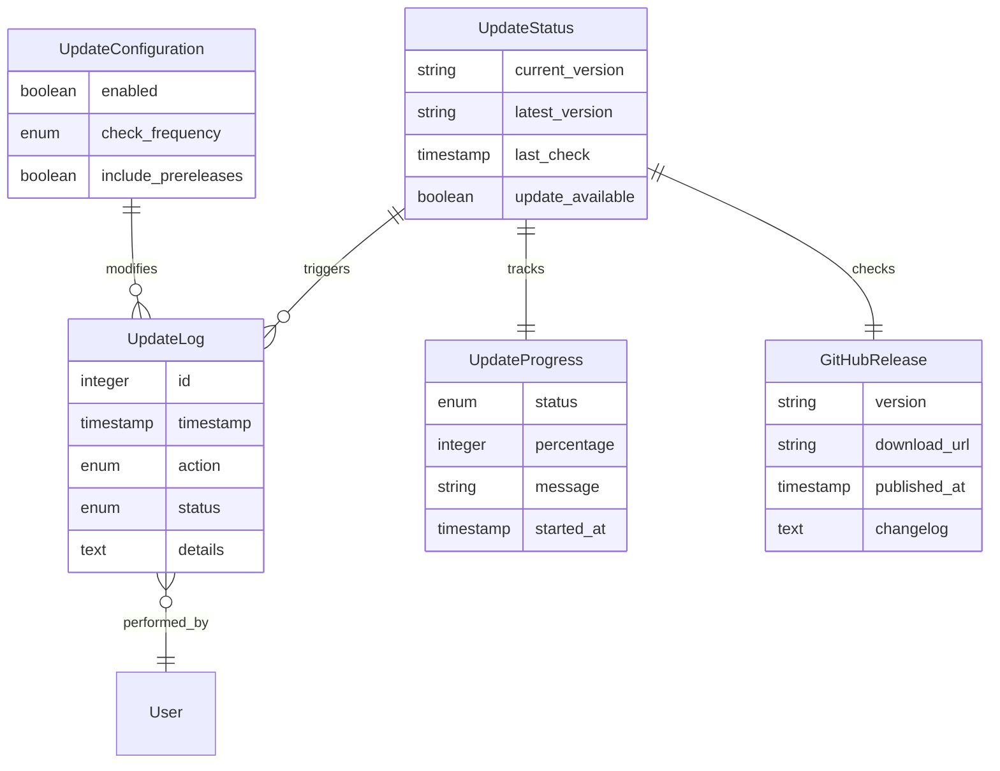

# Data Model: One-Click Automated Update

**Date**: 2025-10-03
**Feature**: One-Click Automated Update System

## Entity Definitions

### 1. UpdateStatus
Tracks the current update state of the plugin.

**Fields**:
- `current_version` (string, required): Currently installed plugin version
- `latest_version` (string, nullable): Latest available version from GitHub
- `last_check` (timestamp, nullable): When updates were last checked
- `next_scheduled_check` (timestamp, nullable): Next automatic check time
- `update_available` (boolean, required): Whether an update is available
- `check_in_progress` (boolean, required): Whether a check is currently running

**Validation Rules**:
- `current_version` must follow semantic versioning (X.Y.Z)
- `latest_version` must follow semantic versioning when present
- `last_check` cannot be in the future
- `update_available` is true only when latest_version > current_version

**Storage**: WordPress transient `cuft_update_status` (12-hour expiration)

### 2. UpdateProgress
Tracks real-time progress of an ongoing update.

**Fields**:
- `status` (enum, required): Current update status
  - Values: `idle`, `checking`, `downloading`, `backing_up`, `installing`, `verifying`, `complete`, `failed`, `rolling_back`
- `percentage` (integer, required): Progress percentage (0-100)
- `message` (string, required): Human-readable status message
- `started_at` (timestamp, required): When update process started
- `stage_started_at` (timestamp, required): When current stage started

**Validation Rules**:
- `percentage` must be between 0 and 100
- `status` transitions must follow valid state machine
- `message` max length 255 characters

**Storage**: WordPress transient `cuft_update_progress` (5-minute expiration)

### 3. GitHubRelease
Represents a release fetched from GitHub API.

**Fields**:
- `version` (string, required): Release version tag
- `download_url` (string, required): ZIP file download URL
- `published_at` (timestamp, required): Release publication date
- `changelog` (text, nullable): Release notes/body
- `file_size` (integer, nullable): Size of release ZIP in bytes
- `is_prerelease` (boolean, required): Whether this is a pre-release
- `is_draft` (boolean, required): Whether this is a draft

**Validation Rules**:
- `version` must match GitHub tag format (v3.0.0 or 3.0.0)
- `download_url` must be HTTPS GitHub URL
- `file_size` must be positive when present
- Ignore releases where `is_draft` is true
- Only use `is_prerelease` if beta support enabled

**Source**: GitHub API `/repos/ChoiceOMG/choice-uft/releases/latest`

### 4. UpdateLog
Audit trail of all update-related activities.

**Fields**:
- `id` (integer, auto-increment): Unique log entry ID
- `timestamp` (timestamp, required): When event occurred
- `action` (enum, required): Type of action performed
  - Values: `check_started`, `check_completed`, `update_started`, `download_started`, `download_completed`, `backup_created`, `install_started`, `install_completed`, `rollback_started`, `rollback_completed`, `error`
- `status` (enum, required): Result of action
  - Values: `success`, `failure`, `warning`, `info`
- `version_from` (string, nullable): Version before action
- `version_to` (string, nullable): Version after action
- `details` (text, nullable): Additional context or error message
- `user_id` (integer, nullable): WordPress user who initiated action

**Validation Rules**:
- `timestamp` cannot be in future
- `version_from` and `version_to` must be valid versions when present
- `details` max length 1000 characters
- `user_id` must reference valid WordPress user when present

**Storage**: WordPress custom table `wp_cuft_update_log` with rotation after 30 days

### 5. UpdateConfiguration
Settings for the update system.

**Fields**:
- `enabled` (boolean, required): Whether auto-updates are enabled
- `check_frequency` (enum, required): How often to check
  - Values: `manual`, `hourly`, `twicedaily`, `daily`, `weekly`
- `include_prereleases` (boolean, required): Whether to include beta versions
- `backup_before_update` (boolean, required): Whether to create backups
- `notification_email` (string, nullable): Email for update notifications
- `github_token` (string, nullable, encrypted): Optional GitHub token for private repos
- `last_modified` (timestamp, required): When settings were last changed
- `modified_by` (integer, required): User who last modified settings

**Validation Rules**:
- `notification_email` must be valid email format when present
- `github_token` must be encrypted before storage
- `check_frequency` respects GitHub rate limits
- `modified_by` must reference valid WordPress user

**Storage**: WordPress options table as `cuft_update_config`

## State Transitions

### Update Status State Machine
```
idle → checking → update_available → downloading → backing_up → installing → verifying → complete
         ↓              ↓                 ↓            ↓            ↓           ↓
      failed         failed           failed       failed       failed      failed → rolling_back → idle
```

### Valid Transitions
1. `idle` → `checking`: Manual or scheduled check initiated
2. `checking` → `update_available`: New version found
3. `checking` → `idle`: No update available
4. `update_available` → `downloading`: Update initiated
5. `downloading` → `backing_up`: Download successful
6. `backing_up` → `installing`: Backup created
7. `installing` → `verifying`: Files extracted
8. `verifying` → `complete`: Update verified
9. Any state → `failed`: Error occurred
10. `failed` → `rolling_back`: Automatic rollback triggered
11. `rolling_back` → `idle`: Rollback complete

## Data Relationships



## Caching Strategy

### Transient Usage
1. **Update Status**: 12-hour cache, cleared on manual check
2. **Update Progress**: 5-minute cache, cleared on completion
3. **GitHub API Response**: 12-hour cache, respects rate limits
4. **Download Cache**: Temporary file, deleted after installation

### Cache Invalidation
- Manual update check clears all update-related transients
- Successful update clears all caches
- Failed update preserves status cache for retry
- Configuration change clears status cache

## Security Considerations

### Data Sanitization
- All version strings sanitized with `sanitize_text_field()`
- URLs validated with `esc_url_raw()` and HTTPS check
- User inputs escaped with appropriate WordPress functions
- SQL queries use prepared statements

### Sensitive Data
- GitHub tokens encrypted using WordPress salts
- No credentials logged in UpdateLog
- Download URLs not exposed to frontend
- File permissions checked before operations

## Performance Considerations

### Indexing
- UpdateLog table indexed on `timestamp` and `action`
- Queries limited to last 30 days by default
- Pagination for log viewing

### Optimization
- Batch inserts for multiple log entries
- Transient preloading on admin_init
- Lazy loading of changelog content
- Background processing for downloads

## Migration Path

### Initial Setup
```sql
CREATE TABLE IF NOT EXISTS {$wpdb->prefix}cuft_update_log (
    id BIGINT UNSIGNED AUTO_INCREMENT PRIMARY KEY,
    timestamp DATETIME NOT NULL,
    action VARCHAR(50) NOT NULL,
    status VARCHAR(20) NOT NULL,
    version_from VARCHAR(20),
    version_to VARCHAR(20),
    details TEXT,
    user_id BIGINT UNSIGNED,
    INDEX idx_timestamp (timestamp),
    INDEX idx_action (action)
);
```

### Data Migration
- Import existing version from plugin header
- Set default configuration values
- Initialize empty update log
- Schedule first update check